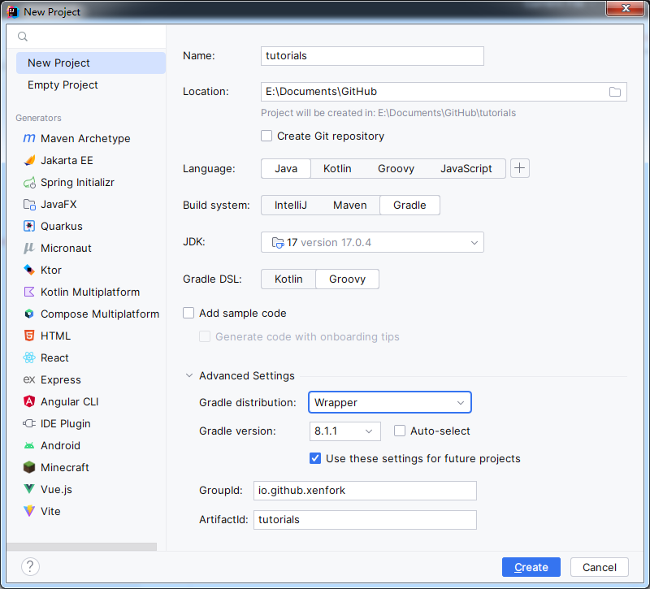

# A very important part - building a development environment

## first step

Use idea to build a gradle project


Then we slightly modify the gradle

Add to the beginning of settings.gradle
```groovy
pluginManagement {
    repositories {
        maven {
            name = 'Fabric'
            url = 'https://maven.fabricmc.net/'
        }
        gradlePluginPortal()
    }
}
```

Modify plugins
```groovy
plugins {
    id 'fabric-loom' version '1.2-SNAPSHOT'
}
```

Modify dependencies
```groovy
dependencies {
    minecraft "com.mojang:minecraft:$minecraft_version"
    mappings "net.fabricmc:yarn:$yarn_mappings:v2"
    modImplementation "net.fabricmc:fabric-loader:$loader_version"
    modImplementation "net.fabricmc.fabric-api:fabric-api:$fabric_version"
}
```

add files gradle.properties
```properties
org.gradle.jvmargs=-Xmx2G

minecraft_version = 1.20.1
alpha_version = 1.20.1
yarn_mappings = 1.20.1+build.2
loader_version=0.14.21
fabric_version=0.83.1+1.20.1

maven_group = io.github.xenfork
mod_version = 1.0-SNAPSHOT

charset = UTF-8
```

Set version and group
```groovy
group = maven_group
version = mod_version
```

delete test
```groovy
test {
    useJUnitPlatform()
}
```

Add the java version in build.gradle for this example to java17
```groovy
def targetJavaVersion =
        Integer.parseInt(String.valueOf((sourceCompatibility = targetCompatibility = JavaVersion.VERSION_17)))
```

processResources is the version parameter injected into the specified file at compile time ${example}

Where charset is the file encoding format

alpha_version is the fabric recognition version for startup. If it is not this version, the game cannot be started
```groovy
processResources {
    filteringCharset charset
    inputs.property "version", version
    inputs.property "minecraft_version", alpha_version
    inputs.property "loader_version", loader_version
    filesMatching("fabric.mod.json") {
        expand "version": version,
                "minecraft_version": alpha_version,
                "loader_version": loader_version
    }
}
```

set java

This is the jar set to java17 with sources
```groovy
java {
    if (JavaVersion.current() < JavaVersion.toVersion(targetJavaVersion))
        toolchain.languageVersion = JavaLanguageVersion.of(targetJavaVersion)

    archivesBaseName = project.name
    withSourcesJar()
}
```

Configure each project when java is compiled
```groovy
tasks.withType(JavaCompile).configureEach {
    
    it.options.encoding = charset
    if (targetJavaVersion >= 10 || JavaVersion.current().isJava10Compatible()) {
        it.options.getRelease().set(targetJavaVersion)
    }
}
```

### optional type

- For projects with protocols, the protocol can be injected into the jar

- from Inside is an absolute path

- ```groovy
  jar {
    from("LICENSE") {
        rename { "${it}_$archivesBaseName" }
    }
  }
- 上传maven库
    - add plugins 
    - ```groovy
      id 'maven-publish'
    - add groovy
    - ```groovy
      publishing {
        publications {
          mavenJava(MavenPublication) {
            artifactId = project.name + "-fabric"
            from components.java
          }
        }
        repositories {
          // Add your own library to it
          mavenLocal()
        }
      }

## such as
- [build.gradle](../tutorials/build.gradle)
- [settings.gradle](../tutorials/settings.gradle)
- [gradle.properties](../tutorials/gradle.properties)
