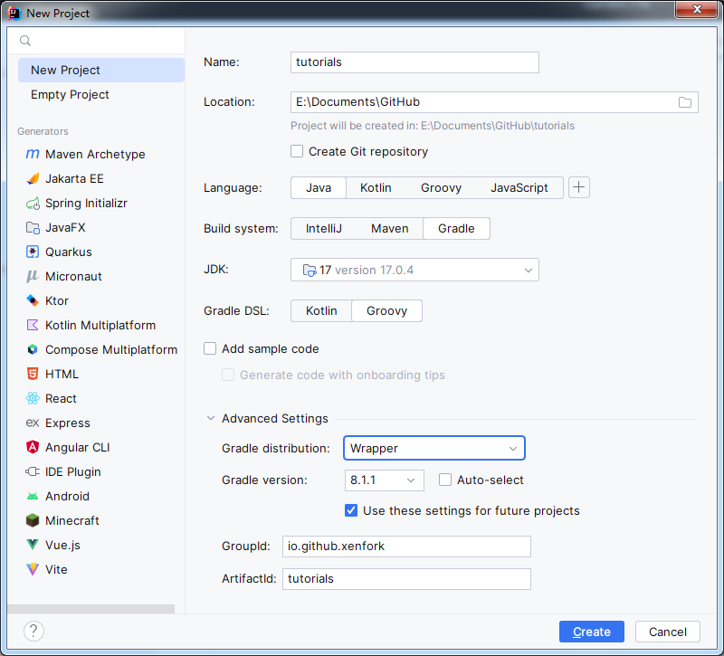

# 一个很重要的一部——搭建开发环境

## 第一步

使用idea构建一个gradle项目


然后我们稍微修改一下gradle

往settings.gradle开头添加
```groovy
pluginManagement {
    repositories {
        maven {
            name = 'Fabric'
            url = 'https://maven.fabricmc.net/'
        }
        gradlePluginPortal()
    }
}
```

修改plugins
```groovy
plugins {
    id 'fabric-loom' version '1.2-SNAPSHOT'
}
```

修改dependencies
```groovy
dependencies {
    minecraft "com.mojang:minecraft:$minecraft_version"
    mappings "net.fabricmc:yarn:$yarn_mappings:v2"
    modImplementation "net.fabricmc:fabric-loader:$loader_version"
    modImplementation "net.fabricmc.fabric-api:fabric-api:$fabric_version"
}
```

添加文件gradle.properties
```properties
org.gradle.jvmargs=-Xmx2G

minecraft_version = 1.20.1
alpha_version = 1.20.1
yarn_mappings = 1.20.1+build.2
loader_version=0.14.21
fabric_version=0.83.1+1.20.1

maven_group = io.github.xenfork
mod_version = 1.0-SNAPSHOT

charset = UTF-8
```

设定版本和组
```groovy
group = maven_group
version = mod_version
```

删除test
```groovy
test {
    useJUnitPlatform()
}
```

build.gradle中添加设定java版本用于此示例为java17
```groovy
def targetJavaVersion =
        Integer.parseInt(String.valueOf((sourceCompatibility = targetCompatibility = JavaVersion.VERSION_17)))
```

processResources为编译时注入到指定文件内的版本参数 ${example}
其中charset为文件编码格式 
alpha_version为启动是fabric识别版本如果不是这个版本则无法启动游戏
```groovy
processResources {
    filteringCharset charset
    inputs.property "version", version
    inputs.property "minecraft_version", alpha_version
    inputs.property "loader_version", loader_version
    filesMatching("fabric.mod.json") {
        expand "version": version,
                "minecraft_version": alpha_version,
                "loader_version": loader_version
    }
}
```

设定java

这个是设定为java17 带sources的jar
```groovy
java {
    if (JavaVersion.current() < JavaVersion.toVersion(targetJavaVersion))
        toolchain.languageVersion = JavaLanguageVersion.of(targetJavaVersion)

    archivesBaseName = project.name
    withSourcesJar()
}
```

设定java编译时配置每个项目
```groovy
tasks.withType(JavaCompile).configureEach {
    
    it.options.encoding = charset
    if (targetJavaVersion >= 10 || JavaVersion.current().isJava10Compatible()) {
        it.options.getRelease().set(targetJavaVersion)
    }
}
```

### 可选的类型

- 对于有协议的项目可以吧协议注入到jar内

- from内为绝对路径

- ```groovy
  jar {
    from("LICENSE") {
        rename { "${it}_$archivesBaseName" }
    }
  }
- 上传maven库
  - plugins添加
  - ```groovy
    id 'maven-publish'
  - 添加groovy
  - ```groovy
    publishing {
      publications {
        mavenJava(MavenPublication) {
            artifactId = project.name + "-fabric"
            from components.java
        }
      }
      repositories {
        // 往里面添加你自己的库
        mavenLocal()
      }
    }

## such as
- [build.gradle](../../../tutorials/build.gradle)
- [settings.gradle](../../../tutorials/settings.gradle)
- [gradle.properties](../../../tutorials/gradle.properties)
